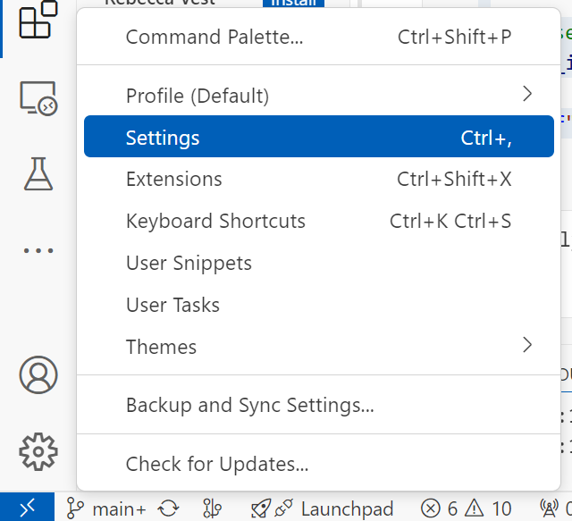
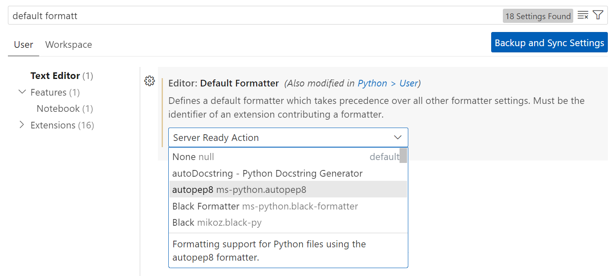

# Session 19: Adventure Game Project


### Randomness 
> Add randomness to the story events. For example, when the player go deep into the forest at first they find a strange creature.
 When they play again and go deep to the forest they find something else, maybe a wand stick
- add randomness using `random` module
- use `random.choice(items)` , where `items` is a list of possible events that could happen
For example:
```python
import random

# Example list
items = ['apple', 'banana', 'cherry', 'date', 'elderberry']

# Choose a random item from the list
random_item = random.choice(items)

print(f"The randomly selected item is: {random_item}")
```

### Test your code
1- install pycodestyle using pip in the terminal (vs/ workspace):
```
pip install pycodestyle
```
2- Run unit tests
```
python unittest_adventure_game_deci-lvl2_v2.py adventure_game.py
```
3- Run unit tests + pycodestyle
```
python unittest_adventure_game_deci-lvl2_v2.py adventure_game.py pycodestyle
```
### To format your code automatically(VS code):
1- install "autopep8" extension
2- From setting search for "default formatter"

3- Choose autopep8

4- In the code file right click and choose "Format Document"

